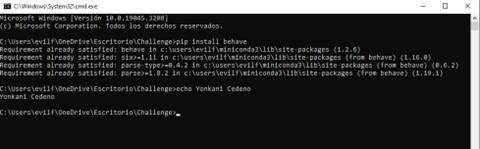
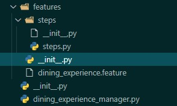
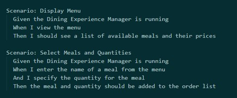
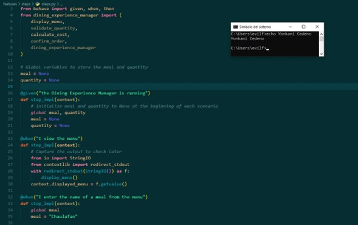
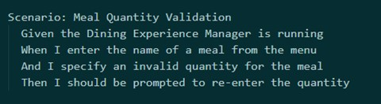
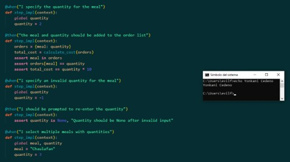
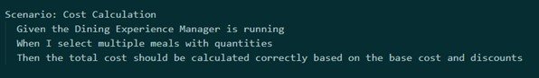
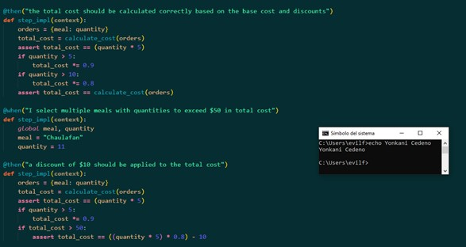
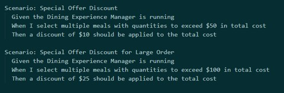
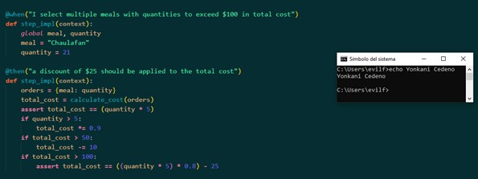

# Challenge

This project aims to create a Dining Experience Manager application that allows users to select meals from a menu, specify the quantity for each meal, and calculate the total cost of the order, including any applicable discounts.

## Table of Contents

1. [Tool Configuration](#tool-configuration)
2. [Installing Behave](#installing-behave)
3. [Generating Features, Steps, Folders, and Files](#generating-features-steps-folders-and-files)
4. [Requirements Specified](#requirements-specified)
    - [Menu and Meal Selection](#menu-and-meal-selection)
    - [Meal Quantity Validation](#meal-quantity-validation)
    - [Cost Calculation](#cost-calculation)
    - [Special Offer Discount](#special-offer-discount)
5. [Acceptance Tests](#acceptance-tests)
6. [Execution](#execution)

## Tool Configuration



## Installing Behave



To install Behave, use pip:
   ```
   pip install behave
   ```

## Generating Features, Steps, Folders, and Files

To generate the required folders and files for Behave, follow these steps:

1. Navigate to the project directory in your terminal or command prompt.
2. Run the following Behave command to generate the necessary structure:
   ```
   behave --init
   ```

This will create the `features` folder and necessary files to start writing your test scenarios.

## Requirements Specified

### Menu and Meal Selection

- The system should display a menu with various dining options and their corresponding prices.
- Users can select multiple meals to order and specify the quantity for each meal.

### Meal Quantity Validation

- The system should validate that the quantity entered for each meal is a positive integer greater than zero.
- If invalid quantities are entered, the Dining Experience Manager should prompt users to re-enter the quantities.

### Cost Calculation

- The base cost for each meal can be decided individually by the system, or it can be $5 each.
- If the total quantity of meals ordered is more than 5, apply a discount of 10% to the total cost.
- If the total quantity of meals ordered is more than 10, apply a discount of 20% to the total cost.

### Special Offer Discount

- The system should have the ability to apply special offer discounts based on certain conditions.
- If the total cost of the meal order exceeds $50, apply a discount of $10 to the total cost.
- If the total cost of the meal order exceeds $100, apply a discount of $25 to the total cost.

## Acceptance Tests

- Menu and Meal Selection

  
  

- Meal Quantity Validation

  
  

- Cost Calculation

  
  

- Special Offer Discount

  
  

## Execution

To execute the tests, run the following command:
```
behave --format=json --outfile=result.json
```

The results will be saved in the `result.json` file.

